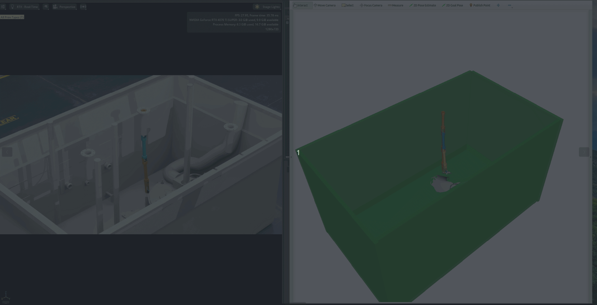

# Hanford MoveIt 2 (MoveItCpp demo + MoveIt config + Isaac Sim USD)

<p align="center">
  
</p>

This repository is intentionally minimal and contains:

- `hanford_arm_moveit_config` — MoveIt 2 configuration package for the Hanford arm
- `hanford_moveit_cpp_demo` — C++ demos using `moveit_cpp` (programmatic planning + execution)
- `usd/` — Isaac Sim / OpenUSD scene files (optional, for simulation + reproducibility)

## Repository layout

```
.
├── hanford_arm_moveit_config/
├── hanford_moveit_cpp_demo/
├── usd/
│   ├── scenes/
│   └── assets/          # only for custom meshes/textures you are allowed to redistribute
└── media/
    └── moveit_short.gif
```

---

## Prerequisites

- Ubuntu 22.04 + ROS 2 Humble (or your target ROS 2 distro)
- MoveIt 2
- A working robot description + ros2_control / controllers (if executing trajectories)
- Isaac Sim (only if opening the USD scenes)

> If you’re using Isaac Sim + ROS 2 bridge, ensure your `/tf` tree, `robot_description`, and controller interfaces match what’s declared in the MoveIt config.

---

## Quick start (ROS 2)

### 1) Create a workspace and clone

```bash
mkdir -p ~/hanford_moveit_ws/src
cd ~/hanford_moveit_ws/src
git clone <YOUR_GITHUB_REPO_URL> hanford_moveit
cd ~/hanford_moveit_ws
```

### 2) Install dependencies

```bash
sudo apt update
rosdep update
rosdep install --from-paths src --ignore-src -r -y
```

### 3) Build

```bash
colcon build --symlink-install
source install/setup.bash
```

---

## Running (MoveIt)

### Find available launch files

```bash
ls $(ros2 pkg prefix --share hanford_arm_moveit_config)/launch
```

Launch one (replace with the actual filename in your package):

```bash
ros2 launch hanford_arm_moveit_config demo.launch.py
# or
ros2 launch hanford_arm_moveit_config move_group.launch.py
```

### Run the MoveItCpp demo node

List executables:

```bash
ros2 pkg executables hanford_moveit_cpp_demo
```

Run one (replace `<executable>`):

```bash
ros2 run hanford_moveit_cpp_demo <executable>
```

---

## Isaac Sim USD scenes

### Where to put the USD
Put your main stage(s) in:

- `usd/scenes/<stage>.usd` (ASCII / text)
- or `usd/scenes/<stage>.usdc` (binary)

If the stage uses **custom** meshes/textures, place them under `usd/assets/` and reference them via **relative paths**.

### Make the USD portable (important)
USD files often reference assets by absolute paths, Nucleus URLs, or local caches. To make the scene portable across machines, use Isaac Sim’s **Collect Asset** workflow and then ensure references are relative inside the collected folder.

**Licensing note:** Avoid committing Isaac Sim stock assets unless redistribution is explicitly allowed. A safe pattern is:
- commit only your custom USD + your custom assets
- document that users must install Isaac Sim and its asset packs locally

### Opening in Isaac Sim
Open the stage from `usd/scenes/`. If materials/meshes are missing, it’s usually a path issue:
re-run “Collect Asset” or fix references to be relative.

---

## Large files (Git LFS)

If you store binary USDs or large textures/meshes, Git LFS is recommended:

```bash
sudo apt install git-lfs
git lfs install
git lfs track "*.usdc" "*.usdz" "*.png" "*.jpg" "*.jpeg" "*.exr" "*.tif" "*.tiff" "*.obj" "*.stl" "*.fbx"
git add .gitattributes
git commit -m "Track large USD/asset files with Git LFS"
```

---

## Troubleshooting

### Planning works but execution does nothing
- Verify the trajectory controller is loaded and active:
  ```bash
  ros2 control list_controllers
  ```
- Confirm MoveIt is targeting the correct controller:
  - check `hanford_arm_moveit_config/config/controllers.yaml` (or similarly named file)

### Start state is in collision / out of bounds
- Verify default joint values in SRDF / joint limits
- Confirm any virtual joint (world ↔ base) is correct

### TF tree mismatch
- Confirm `robot_state_publisher` is publishing expected frames
- Verify planning frame, base link, and tool link names match across URDF, SRDF, and MoveIt params

---

## Maintainer

MD Munim Rayhan
